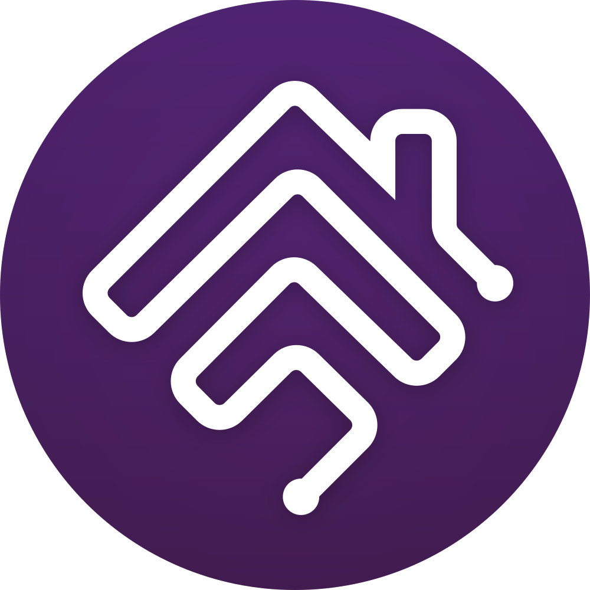

<div align="center">

  <div style="padding: 100px 0;">
    
    &nbsp;&nbsp;&nbsp;&nbsp;
    
  </div>

  <h1>Homebridge YS7</h1>
  <p>EZVIZ (YS7) camera plugin for Homebridge with HKSV support, battery/indicator polling, and simple configuration.</p>

  <p>
    <a href="README.zh.md">中文说明</a>
    ·
    <a href="https://github.com/fantasytu/homebridge-ys7/issues">Report a Bug</a>
  </p>

  <p>
    <a href="https://www.npmjs.com/package/homebridge-ys7"></a>
    <a href="https://www.npmjs.com/package//homebridge-ys7"></a>
    <a href="LICENSE"></a>
    <a href="https://github.com/fantasytu/homebridge-ys7"></a>
    <a href="https://github.com/sponsors/fantasytu"></a>
  </p>
</div>

### Features

- HKSV streaming for supported EZVIZ cameras
- Optional battery service (level, low-battery, charging state)
- Optional indicator light as a Lightbulb service (on/off)
- Configurable polling to keep battery and indicator states updated
- Skips unsupported or offline devices (configurable)

### Requirements

- Node.js 18+ (recommended) and a working Homebridge instance
- EZVIZ App Key and App Secret

### Install

```bash
npm i -g @fantasytu/homebridge-ys7
```

### Configure

Add a platform block in your Homebridge `config.json`:

```json
{
  "platforms": [
    {
      "platform": "YS7Platform",
      "name": "YS7Platform",
      "appKey": "YOUR_APP_KEY",
      "appSecret": "YOUR_APP_SECRET",
      "videoProcessor": "ffmpeg",
      "skipOfflineDevices": true,
      "pollingInterval": 60
    }
  ]
}
```

Configuration fields:

- `platform` (required): must be `YS7Platform`
- `appKey` (required): EZVIZ App Key
- `appSecret` (required): EZVIZ App Secret
- `videoProcessor` (optional): path/name of ffmpeg, default `ffmpeg`
- `skipOfflineDevices` (optional): skip cameras reported offline, default `true`
- `pollingInterval` (optional): seconds between polls for battery/indicator, default `60`, minimum `10`

### How it works

- On launch, the plugin discovers cameras via EZVIZ APIs.
- For eligible models, it sets up HKSV and adds services for Motion, Battery, and Indicator.
- A background timer polls camera state every `pollingInterval` seconds and updates HomeKit characteristics.

### Troubleshooting

- Make sure `appKey`/`appSecret` are valid and bound to your EZVIZ account.
- If streams fail, ensure ffmpeg is installed and reachable by the `videoProcessor` path.
- Increase logging in Homebridge and check for network/firewall blocks to EZVIZ endpoints.

### Acknowledgements

- Built on the Homebridge ecosystem and community.
- EZVIZ/YS7 API usage subject to their terms.

### License

MIT